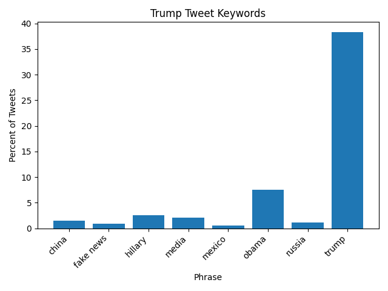

|            phrase | percent of tweets |
| ----------------- | ----------------- |
|             china | 01.51             |
|         fake news | 00.92             |
|           hillary | 02.57             |
|             media | 02.06             |
|            mexico | 00.55             |
|             obama | 07.47             |
|            russia | 01.13             |
|             trump | 38.35             |

In Trump's tweets, he mentions himself 38% of the time, and mentions Mexico less than 1% of the time which is surprising. 